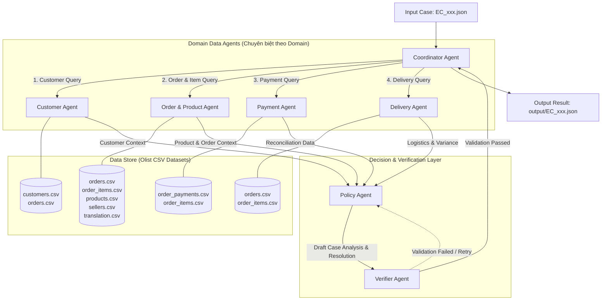
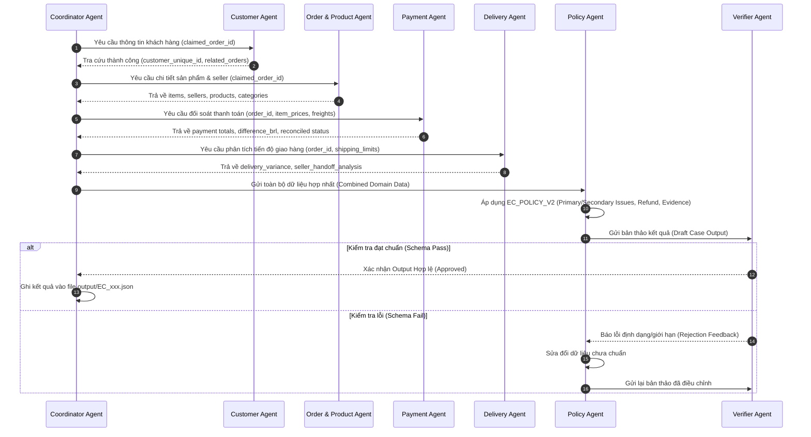

# Kiến Trúc Hệ Thống Multi-Agent: E-commerce Dispute Resolution (EC_POLICY_V2)

Hệ thống xử lý khiếu nại thương mại điện tử tự động được xây dựng dựa trên kiến trúc **Agent-to-Agent (A2A)** chuyên biệt hóa theo từng miền dữ liệu (Domain-Specific Agents), điều phối bởi một **Coordinator Agent** và kiểm soát chất lượng nghiêm ngặt qua **Verifier Agent**.

---

## 1. Sơ Đồ Tổng Quan Kiến Trúc (System Architecture Diagram)

---

## 2. Vai Trò Và Phân Công Nhiệm Vụ (Agent Roles & Responsibilities)

| Agent | Vai Trò Chính | Đầu Vào (Input) | Đầu Ra (Output) |
| :--- | :--- | :--- | :--- |
| **Coordinator Agent** | Điều phối toàn bộ quy trình, giao việc cho các Domain Agent, thu thập dữ liệu và xuất file output JSON cuối cùng. | File khiếu nại `input/EC_xxx.json` | File kết quả `output/EC_xxx.json` & log trace |
| **Customer Agent** | Truy vết danh tính khách hàng và lịch sử mua hàng liên quan. | `claimed_order_id` | `customer_unique_id`, `related_order_ids`, cờ `repeat_customer` |
| **Order & Product Agent** | Phân tích chi tiết danh mục hàng hóa, số lượng item, thông tin sản phẩm và người bán (sellers). | `claimed_order_id` | `item_ids`, `seller_ids`, `product_ids`, `category_names`, cờ `multi_item_order`, `multi_seller_order`, `multiple_categories` |
| **Payment Agent** | Tổng hợp các dòng thanh toán, tính toán kỳ vọng giá trị đơn và thực hiện đối soát tài chính. | `claimed_order_id`, dữ liệu items | `item_total_brl`, `freight_total_brl`, `expected_total_brl`, `payment_total_brl`, `difference_brl`, `reconciled`, `payment_types`, cờ `split_payment` |
| **Delivery Agent** | Phân tích mốc thời gian vận chuyển, tính độ lệch giao hàng và xác định lỗi trễ hạn từ Seller hay Vận chuyển. | `claimed_order_id`, thông tin items | `delivered_at`, `estimated_delivery_at`, `carrier_handoff_at`, `delivery_variance_hours`, `seller_handoff_analysis`, `late_handoff_seller_ids` |
| **Policy Agent** | Đóng vai trò bộ não quyết định. Áp dụng quy tắc `EC_POLICY_V2` để suy luận vấn đề chính/phụ, bên chịu trách nhiệm, bằng chứng và khoản hoàn tiền. | Dữ liệu tổng hợp từ 4 Domain Agents | `primary_issue`, `secondary_issues`, `case_status`, `confidence`, `ranked_causes`, `responsible_parties`, `evidence_ids`, `recommended_refund_brl`, `resolution_actions` |
| **Verifier Agent** | Kiểm tra độc lập tính hợp lệ của dữ liệu, quy tắc format ID, giới hạn độ dài mảng, xử lý `null` và tính toàn vẹn của JSON schema. | Draft output từ Policy Agent | Báo cáo hợp lệ (Pass/Fail) kèm các lỗi cần điều chỉnh nếu có |

---

## 3. Quyền Truy Cập Dữ Liệu (Data Access Permissions Scope)

Để tuân thủ nguyên tắc đóng đóng/mở mở (Principle of Least Privilege), từng Agent chỉ được cấp quyền đọc các bảng dữ liệu liên quan:

- **Customer Agent:** Chi tiếp cận `customers.csv` và `orders.csv`.
- **Order & Product Agent:** Chi tiếp cận `orders.csv`, `order_items.csv`, `products.csv`, `sellers.csv`, `product_category_name_translation.csv`.
- **Payment Agent:** Chỉ tiếp cận `order_payments.csv` và `order_items.csv`.
- **Delivery Agent:** Chỉ tiếp cận `orders.csv` và `order_items.csv`.
- **Policy Agent & Verifier Agent:** Không đọc trực tiếp dữ liệu thô CSV; chỉ làm việc trên dữ liệu đã được trích xuất và cấu trúc hóa từ các Domain Agent.

---

## 4. Luồng Chuyển Giao Dữ Liệu (Handoff Sequence Flow)

---

## 5. Quy Tắc Quyết Định & Thẩm Định Quyền Hạn (EC_POLICY_V2 Rules Matrix)

Policy Agent tuân thủ bảng cây quyết định ưu tiên cao nhất từ trên xuống dưới:

| Thứ tự Ưu tiên | Primary Issue | Điều Kiện Kích Hoạt | Bên Chịu Trách Nhiệm | Tiền Hoàn Đề Xuất | Hành Động Chính (Primary Action) |
| :---: | :--- | :--- | :--- | :--- | :--- |
| **1** | `canceled_order_paid` | `order_status = canceled` & Tổng payment > 0 | `platform` / `OLIST_PLATFORM` | Tổng payment | `issue_full_refund` |
| **2** | `unavailable_order_paid` | `order_status = unavailable` & Tổng payment > 0 | `platform` / `OLIST_PLATFORM` | Tổng payment | `issue_full_refund` |
| **3** | `late_delivery_seller` | Giao trễ so với estimated **VÀ** carrier nhận muộn $\ge 1$ `shipping_limit_date` | `seller` / Các seller vi phạm | Tổng freight | `refund_freight` |
| **4** | `late_delivery_logistics` | Giao trễ so với estimated **NHƯNG** không seller nào bàn giao muộn | `logistics_provider` / `LOGISTICS_PROVIDER` | Tổng freight | `refund_freight` |
| **5** | `valid_split_payment` | Có $\ge 2$ payment rows & tổng payment khớp total item + freight (sai số $\le 0.10$ BRL) | Không có | 0 | `explain_valid_split_payment` |
| **6** | `unsupported_late_claim` | Đơn giao đúng/sớm hơn estimated date & payment khớp | Không có | 0 | `reject_late_refund` |

### Quy tắc Secondary Issues (Thứ tự thêm cố định):
1. `multi_item_order`: Số dòng item $\ge 2$.
2. `multi_seller_order`: Số seller khác nhau $\ge 2$.
3. `split_payment`: Số dòng thanh toán $\ge 2$.
4. `repeat_customer`: Cùng `customer_unique_id` có đơn hàng khác.
5. `multiple_categories`: Danh mục sản phẩm $\ge 2$.

---

## 6. Cơ Chế Kiểm Chứng Dữ Liệu (Verifier Guardrails & Validation)

**Verifier Agent** đóng vai trò là chốt chặn cuối cùng trước khi lưu file, kiểm soát các điều kiện:

1. **Giới Hạn Kích Thước Mảng (Array Length Limits):**
   - `order_ids` $\le 5$, `item_ids` $\le 5$, `seller_ids` $\le 3$, `payment_ids` $\le 5$, `related_order_ids` $\le 5$, `product_ids` $\le 5$, `category_names` $\le 5$, `ranked_causes` $\le 3$, `responsible_parties` $\le 3$, `evidence_ids` $\le 20$, `resolution_actions` $\le 5$.
2. **Cấu Trúc Evidence ID (Syntax Validation):**
   - Chỉ chấp nhận 5 mẫu regex hợp lệ: `order:<order_id>`, `item:<order_id>:<item_id>`, `payment:<order_id>:<seq>`, `seller:<seller_id>`, `policy:<root_cause_code>`.
3. **Tính Toán & Làm Tròn (Numeric Integrity):**
   - Mọi số tiền (BRL) và thời gian (Hours) bắt buộc làm tròn 2 chữ số thập phân.
   - `confidence` bắt buộc nằm trong khoảng $[0.0, 1.0]$.
4. **Xử Lý Null & Mảng Rỗng (Empty Item Handling):**
   - Nếu đơn hàng không có item: `expected_total_brl`, `difference_brl`, `reconciled` phải mang giá trị `null`. Các mảng items, sellers, products, categories và seller handoff phải trả về mảng rỗng `[]`.
