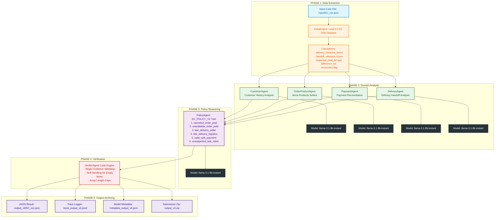

# Workflow Chi Tiết Hệ Thống Multi-Agent (A2A) — Dispute Resolution Pipeline

Tài liệu này mô tả chi tiết luồng xử lý thực thi (Execution Workflow), giao thức giao tiếp giữa các Agents, và vị trí của các **Model LLM ($\le$ 10B)** trong kiến trúc Multi-Agent giải quyết khiếu nại thương mại điện tử Olist theo chính sách `EC_POLICY_V2`.

---

## 1. Sơ đồ Kiến trúc & Luồng Thực thi (Detailed Execution Workflow)

---

## 2. Phân Bổ Model LLM Kỹ Thuật (Model Allocation Matrix)

| Vị trí / Agent | Nhiệm vụ chính | Provider | Tên Model | Tham số | Giới hạn quy định |
| :--- | :--- | :--- | :--- | :--- | :--- |
| **Domain Agents** (`CustomerAgent`, `OrderProductAgent`, `PaymentAgent`, `DeliveryAgent`) | Trích xuất ngữ cảnh chuyên biệt, phân tích định danh khách hàng, đơn hàng, thanh toán và vận chuyển. | Groq API | `llama-3.1-8b-instant` | 8B | $\le$ 10B |
| **Policy Agent** (`PolicyAgent`) | Suy luận phán quyết theo cây ưu tiên chính sách `EC_POLICY_V2`, quyết định hoàn tiền, gán nguyên nhân gốc rễ và hành động. | Groq API | `llama-3.1-8b-instant` | 8B | $\le$ 10B |
| **Verifier Agent** (`VerifierAgent`) | Thực thi quy tắc Deterministic Python Rule Engine, lọc Regex Evidence ID, xử lý Null và gọt mảng theo giới hạn schema. | Deterministic Python Engine | N/A (Code Python) | N/A | Khống chế lỗi hallucination |

---

## 3. Giải Thích Chi Tiết Luồng Xử Lý 5 Phase (Phase-by-Phase Explanation)

### 🔹 Phase 1: Data Extraction & Deterministic Calculation (Triệt xóa ảo giác số học)
- **Vấn đề giải quyết:** Các LLM (đặc biệt các dòng $\le$ 10B) rất dễ gặp lỗi ảo giác (hallucination) khi làm toán trừ mốc thời gian timestamp (`YYYY-MM-DD HH:MM:SS`) hoặc cộng trừ làm tròn tiền tệ 2 chữ số thập phân (`BRL`).
- **Giải pháp:** `DataEngine` chịu trách nhiệm đọc 9 file CSV Olist, lập chỉ mục siêu tốc bằng `pandas`, tính toán số học 100% bằng code Python thuần:
  - `delivery_variance_hours` = ngày giao thực tế - ngày giao dự kiến.
  - `handoff_variance_hours` = ngày carrier bàn giao - ngày shipping limit sớm nhất của seller.
  - `expected_total_brl` = tổng giá sản phẩm + tổng phí vận chuyển freight.
  - `difference_brl` = tổng tiền khách thanh toán - expected_total_brl.
  - `reconciled` = `abs(difference_brl) <= 0.10 BRL`.

### 🔹 Phase 2: Domain Agents Processing (Song Song Miền Thông Tin)
- Hệ thống chia nhỏ dữ liệu và phân phối cho 4 Chuyên gia miền (Domain Agents):
  - **`CustomerAgent`**: Xác định `customer_unique_id` và quét lịch sử các đơn hàng khác (`related_order_ids`), sắp xếp theo thứ tự thời gian tăng dần.
  - **`OrderProductAgent`**: Trích xuất mã sản phẩm, danh mục tiếng Bồ Đào Nha gốc (`product_category_name`), và danh sách các Seller tham gia đơn.
  - **`PaymentAgent`**: Tổng hợp hình thức thanh toán (`payment_types`) và xác nhận cờ `split_payment` ($\ge$ 2 giao dịch thanh toán).
  - **`DeliveryAgent`**: Xác định mốc thời gian vận chuyển, đánh giá đơn giao trễ thuộc về Seller (bàn giao carrier trễ) hay thuộc Vận chuyển (logistics carrier giao trễ).
- **Model LLM:** Tất cả 4 Domain Agents gọi Groq API qua model **`llama-3.1-8b-instant`** (8B parameters) để cấu trúc hóa ngữ cảnh chuyên miền.

### 🔹 Phase 3: Policy Agent Reasoning (Bộ Não Suy Luận Chính)
- **`PolicyAgent`** đóng vai trò Thẩm phán trung tâm. Nhận toàn bộ ngữ cảnh hợp nhất từ Phase 1 & 2 và thực thi cây suy luận ưu tiên theo **`EC_POLICY_V2`**:
  1. `canceled_order_paid`: Đơn hủy có thanh toán $\rightarrow$ Hoàn 100% thanh toán (`issue_full_refund`).
  2. `unavailable_order_paid`: Đơn hết hàng/không sẵn có $\rightarrow$ Hoàn 100% thanh toán (`issue_full_refund`).
  3. `late_delivery_seller`: Giao muộn do Seller bàn giao trễ $\rightarrow$ Hoàn 100% phí freight (`refund_freight`).
  4. `late_delivery_logistics`: Giao muộn do Carrier vận chuyển trễ $\rightarrow$ Hoàn 100% phí freight (`refund_freight`).
  5. `valid_split_payment`: Đơn tách thanh toán hợp lệ $\rightarrow$ Hoàn 0.0 BRL (`explain_valid_split_payment`).
  6. `unsupported_late_claim`: Khiếu nại giao muộn không hợp lệ $\rightarrow$ Bác bỏ (`reject_late_refund`).
- **Model LLM:** Gọi Groq API qua model **`llama-3.1-8b-instant`** (8B parameters $\le$ 10B limit).

### 🔹 Phase 4: Verifier Agent Guardrails (Rào Chắn Bằng Code Chắc Chắn 100%)
- **`VerifierAgent`** chạy 100% bằng Python Code Engine để thẩm định và sửa lỗi output trước khi xuất file:
  - **Regex Validation:** Ép đúng 5 định dạng Regex chuẩn của `evidence_ids` (`order:`, `item:`, `payment:`, `seller:`, `policy:`).
  - **Null Handling:** Nếu đơn hàng không có sản phẩm (`has_items == False`), ép `expected_total_brl`, `difference_brl`, `reconciled` về `null`, mảng items/sellers/products/categories về `[]`.
  - **Array Length Caps:** Cắt bớt mảng nếu vượt trần (`evidence_ids` $\le 20$, `resolution_actions` $\le 5$, `seller_ids` $\le 3$, `order_ids` $\le 5$).

### 🔹 Phase 5: Output Archiving & Portal Zip Packaging
- Kết quả được lưu vào thư mục `output_v3/EC_001.json` ... `output_v3/EC_050.json`.
- Ghi vết thực thi vào `trace_output_v3.jsonl` và khai báo model kỹ thuật vào `metadata_output_v3.json`.
- Đóng gói file nộp bài **`output_v3.zip`** chứa đúng tiền tố `output/EC_001.json` $\rightarrow$ `output/EC_050.json` khớp 100% yêu cầu autograder.