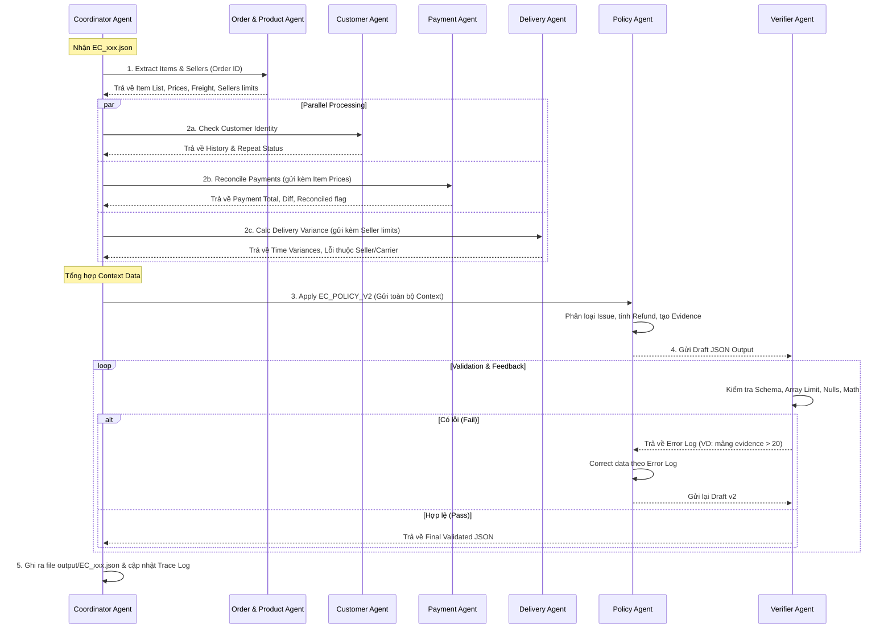

Dựa trên tài liệu nghiệp vụ và yêu cầu kiến trúc bạn đã cung cấp, tôi đề xuất một **Workflow chi tiết cho Hệ thống Multi-Agent**. Workflow này đảm bảo tính đóng gói (encapsulation), chuyển giao trạng thái (state hand-off) rõ ràng và tuân thủ nghiêm ngặt nguyên tắc chia để trị (divide and conquer), tuyệt đối không gộp chung vào một prompt.

Dưới đây là chi tiết luồng xử lý và giao thức giao tiếp giữa các Agents.

---

## 1. Sơ đồ Luồng Thực thi (Execution Workflow)



---

## 2. Chi tiết Workflow & Chuyển giao dữ liệu (Handoffs)

Quy trình xử lý một case (`EC_xxx.json`) sẽ trải qua **5 Phase** với các Payload (cấu trúc dữ liệu) được quy định nghiêm ngặt khi Handoff.

### Phase 1: Phân tích Dữ liệu Gốc (Order & Product Agent)

Vì Payment và Delivery cần thông tin từ Items (giá tiền, hạn giao hàng), **Order & Product Agent** phải chạy đầu tiên.

* **Input:** `claimed_order_id` từ Coordinator.
* **Nhiệm vụ:** Truy vấn `orders.csv`, `order_items.csv`, `products.csv`, `sellers.csv`. Lấy danh sách sản phẩm, category, tính tổng `price`, tổng `freight_value` và mốc `shipping_limit_date` sớm nhất của từng seller.


* **Handoff Output (chuyển về Coordinator):**
```json
{
  "order_status": "...",
  "items_data": {
     "item_ids": ["..."],
     "product_ids": ["..."],
     "category_names": ["..."],
     "seller_ids": ["..."],
     "expected_item_total": 100.0,
     "expected_freight_total": 20.0
  },
  "shipping_limits": {"seller_A": "2018-05-10", "seller_B": "2018-05-12"}
}

```


* *Quy tắc ngoại lệ:* Nếu đơn hàng không có item, mảng trả về rỗng `[]`, các số tiền = `null`.


### Phase 2: Phân tích Song song (Customer, Payment, Delivery)

Coordinator dùng dữ liệu từ Phase 1 để gọi 3 Agent phân tích chuyên sâu (có thể chạy bất đồng bộ/parallel để tiết kiệm thời gian).

**2A. Customer Agent**

* **Input:** `claimed_order_id`.
* **Nhiệm vụ:** Map `customer_id` ra `customer_unique_id`, quét lại toàn bộ `orders.csv` để tìm `related_order_ids`.


* **Handoff Output:** `{"customer_unique_id": "...", "related_order_ids": ["..."], "repeat_customer": true/false}`.

**2B. Payment Agent**

* **Input:** `claimed_order_id`, `expected_item_total`, `expected_freight_total` (Từ Phase 1).
* **Nhiệm vụ:** Sum `payment_value` trong `order_payments.csv`. So sánh tổng payment với `expected_total_brl`.


* **Handoff Output:** `{"payment_total_brl": 120.0, "difference_brl": 0.0, "reconciled": true, "split_payment": false}`.


**2C. Delivery Agent**

* **Input:** `claimed_order_id`, `shipping_limits` (Từ Phase 1).
* **Nhiệm vụ:** Lấy các mốc thời gian, tính `delivery_variance_hours` và `handoff_variance_hours`. Đánh giá lỗi do Seller hay Logistics.


* **Handoff Output:** `{"is_late_delivery_seller": false, "is_late_delivery_logistics": true, "carrier_handoff_variance_hours": 48.5}`.


### Phase 3: Khai thác Chính sách (Policy Agent - BỘ NÃO)

Coordinator tổng hợp toàn bộ JSON Output từ Phase 1 & 2 thành một cục `Global_Context` và gửi cho Policy Agent.

* **Input:** `Global_Context` (chứa toàn bộ kết quả của 4 Agent trên) + `EC_POLICY_V2`.
* **Nhiệm vụ:**
1. *Chạy IF-ELSE theo mức độ ưu tiên:* Canceled -> Unavailable -> Late Seller -> Late Logistics -> Valid Split -> Unsupported.


2. *Áp dụng Secondary Issues:* Kích hoạt cờ nếu thỏa mãn điều kiện `multi_item_order`, `repeat_customer`, v.v..


3. *Tạo Actions & Refund:* Quyết định số tiền bồi hoàn (`refund_freight`, `issue_full_refund` hoặc 0) và gán `case_status`.


4. *Khởi tạo mảng Evidence:* Sinh ra chuỗi format `order:<id>`, `item:<id>:<id>`, v.v..


* **Handoff Output:** Một bản `Draft_Resolution_JSON` chứa toàn bộ các trường output theo yêu cầu.

### Phase 4: Kiểm duyệt Khắt khe (Verifier Agent - BẢO VỆ)

Policy Agent không được phép trả thẳng file cho Coordinator mà phải đưa qua Verifier Agent thẩm định.

* **Input:** `Draft_Resolution_JSON` từ Policy Agent.
* **Nhiệm vụ & Rules:**
* **Rule 1 (Mảng):** Kiểm tra `evidence_ids.length <= 20`, `actions.length <= 5`, `order_ids.length <= 5`, v.v. Trích xuất và cắt bỏ phần thừa (hoặc bắt Policy tạo lại).


* **Rule 2 (Format):** Dùng Regex check từng item trong `evidence_ids`. Nếu sai format (ví dụ: `product:123` - format sai), xóa bỏ.


* **Rule 3 (Toán học):** Check giá trị `confidence` $\in [0, 1]$. Đảm bảo các trường tiền tệ (BRL) và thời gian (Hours) làm tròn 2 chữ số thập phân.


* **Rule 4 (Null Handling):** Check nếu order không có items, thì các mảng liên quan có rỗng `[]` không và expected total có trả về `null` không.


* **Vòng lặp Feedback (Crucial):**
* Nếu PASS: Gắn cờ `"verified": true` và chuyển về Coordinator.
* Nếu FAIL: Generate một chuỗi Prompt Feedback: *"Error: evidence_ids chứa định dạng sai 'product:123'. Giới hạn actions đang là 6 (Max là 5). Yêu cầu Policy Agent sửa lại."* và gọi lại Policy Agent.


### Phase 5: Xuất File (Coordinator Agent)

* **Nhiệm vụ:** Nhận `Validated_JSON` từ Verifier. Bọc lại theo đúng schema của bài thi và ghi ra file vào thư mục `output/EC_xxx.json`. Ghi lại hành trình vào `trace.jsonl`.


---

## 3. Lời khuyên Kỹ thuật khi Cài đặt (Implementation Tips)

1. **System Prompt theo vai trò:** Đừng dùng prompt chung chung.
* *Delivery Agent:* "Bạn là chuyên gia Logistics. Hãy làm toán trừ thời gian chính xác và làm tròn 2 chữ số..."
* *Policy Agent:* "Bạn là Thẩm phán. Bạn CHỈ được phép ra quyết định dựa trên dữ liệu đã cung cấp, tuyệt đối tuân thủ theo thứ tự 1-6 của EC_POLICY_V2..."


2. **Xử lý LLM Parameter Limit ($\le$ 10B):** Các LLM nhỏ rất dễ bị ảo giác (hallucination) độ dài. Việc có **Verifier Agent** thiết kế theo dạng *Deterministic Code* (dùng Python Pydantic hoặc JSON Schema validation cứng thay vì dùng LLM) kết hợp LLM sửa lỗi sẽ hiệu quả nhất và không bị trừ điểm. Bạn có thể code Verifier Agent bằng Python thuần túy.
3. **Database Access:** Mỗi Data Agent nên được cấp các hàm (Tool Calling / Function Calling) thực thi SQL trên Pandas DataFrame tĩnh (vì là file CSV) hoặc SQLite in-memory thay vì bắt LLM đọc file text CSV thô.